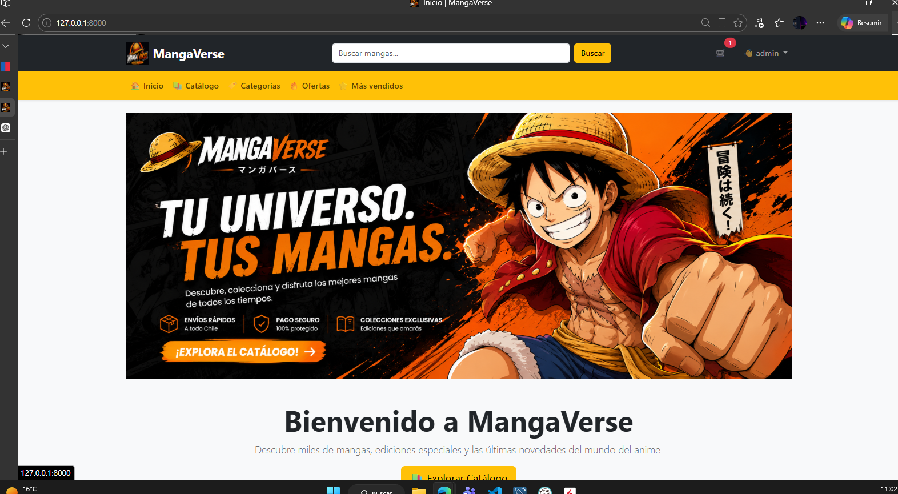
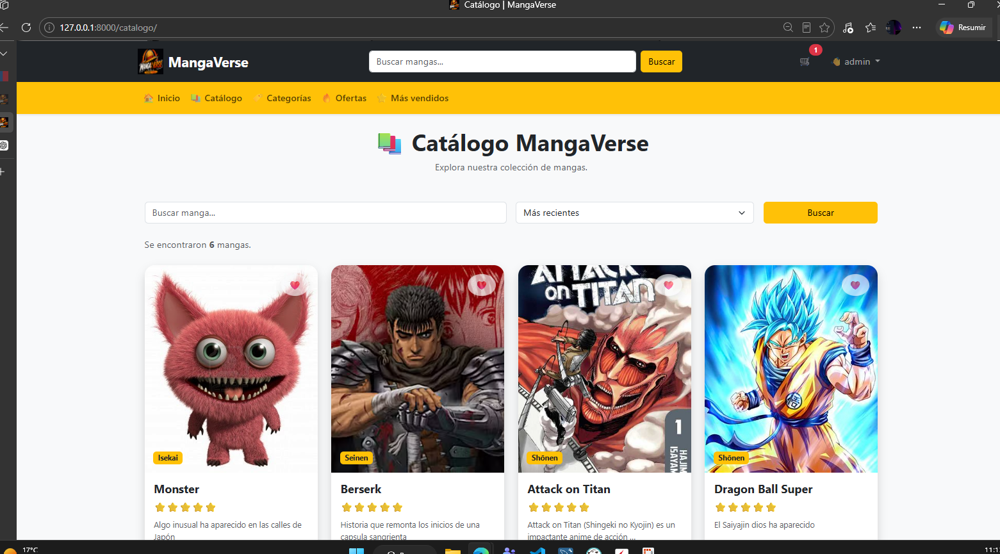
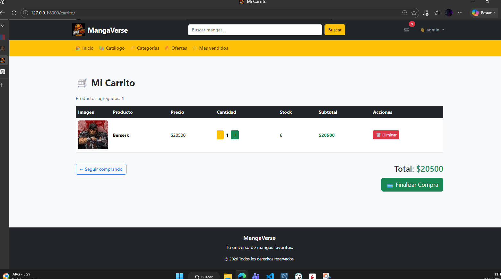
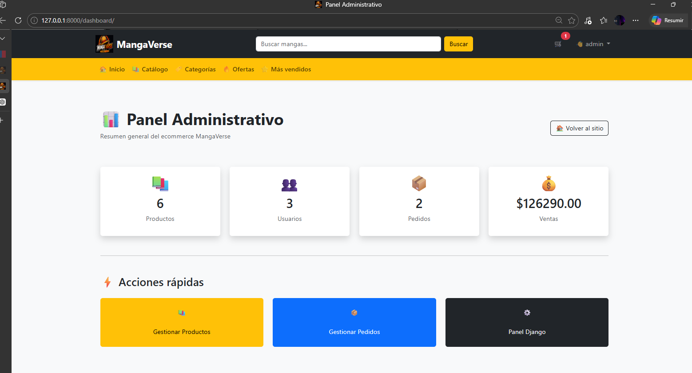
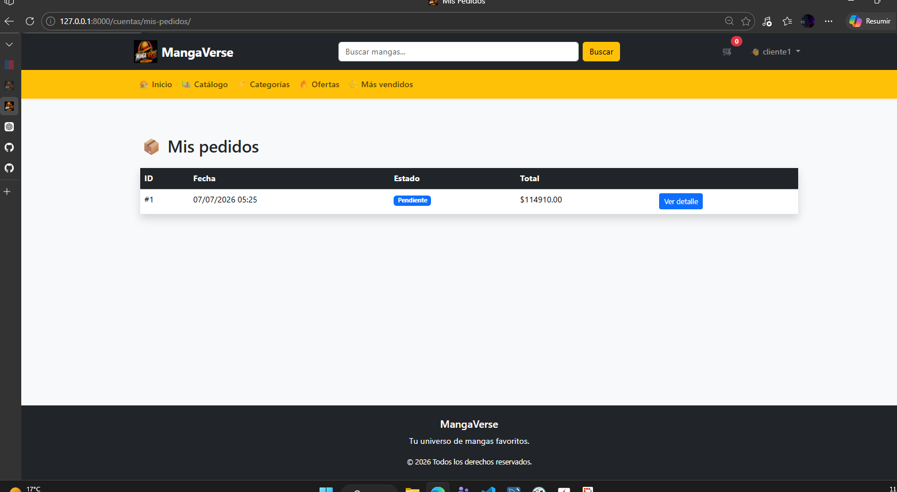

# 📚 MangaVerse

**Repositorio del proyecto**

https://github.com/bryanverastegui5-star/Portafolio-Ecommerce

<p align="center">


</p>

<h1 align="center">

MangaVerse

</h1>

<p align="center">

Proyecto Final de Desarrollo Web con Django

</p>

---

# 📖 Descripción

MangaVerse es una plataforma Ecommerce desarrollada utilizando **Django**, **PostgreSQL** y **Bootstrap 5**, cuyo objetivo es simular el funcionamiento de una tienda online especializada en mangas.

El proyecto permite a los usuarios registrarse, iniciar sesión, explorar un catálogo de productos, gestionar un carrito de compras y realizar pedidos. Además, cuenta con un panel administrativo para la gestión del catálogo y el monitoreo general del sistema.

---

# 🎯 Objetivos del Proyecto

- Aplicar el patrón MTV de Django.
- Implementar un sistema completo de autenticación.
- Desarrollar un Ecommerce funcional.
- Integrar PostgreSQL como base de datos.
- Utilizar Bootstrap para una interfaz responsive.
- Gestionar pedidos y compras de usuarios.

---

# 🖼 Vista General

<p align="center">


</p>

---

# 🚀 Funcionalidades

## 👤 Usuarios

- Registro de usuarios
- Inicio de sesión
- Cierre de sesión
- Perfil de usuario
- Historial de pedidos

---

## 📚 Productos

- CRUD completo
- Catálogo
- Búsqueda
- Categorías
- Detalle de producto
- Paginación

---

## 🛒 Carrito

- Agregar productos
- Eliminar productos
- Aumentar cantidad
- Disminuir cantidad
- Total automático
- Validación de stock

---

## 📦 Pedidos

- Finalizar compra
- Registro automático
- Historial
- Detalle de pedidos

---

## ⚙ Administración

- CRUD Productos
- Dashboard Administrativo
- Panel Django
- Gestión de pedidos

---

# 🏗 Arquitectura

El proyecto fue desarrollado siguiendo el patrón **MTV (Model - Template - View)** de Django.

```
Cliente

↓

Templates

↓

Views

↓

Models

↓

PostgreSQL
```

---

# 📂 Estructura del Proyecto

```
Portafolio Ecommerce/

│

├── ecommerce/

├── productos/

├── carrito/

├── cuentas/

├── pedidos/

│

├── media/

├── static/

├── templates/

│

├── docs/

│

├── manage.py

└── README.md
```

---

# 🛠 Tecnologías

| Tecnología | Descripción |
|------------|-------------|
| Python 3.13 | Lenguaje principal |
| Django 6 | Framework Backend |
| PostgreSQL | Base de datos |
| Bootstrap 5 | Frontend |
| HTML5 | Templates |
| CSS3 | Diseño |
| JavaScript | Interacciones |

---

# 💾 Base de Datos

Motor utilizado:

```
PostgreSQL
```

Configuración:

```
DATABASE_NAME = ecommerce_final
PORT = 5432
```

---

# ⚙ Instalación

## 1 Clonar repositorio

```bash
git clone https://github.com/bryanverastegui5-star/Portafolio-Ecommerce
```

---

## 2 Entrar al proyecto

```bash
cd MangaVerse
```

---

## 3 Crear entorno virtual

```bash
python -m venv env
```

---

## 4 Activarlo

Windows

```bash
env\Scripts\activate
```

Linux

```bash
source env/bin/activate
```

---

## 5 Instalar dependencias

```bash
pip install -r requirements.txt
```

---

## 6 Aplicar migraciones

```bash
python manage.py makemigrations

python manage.py migrate
```

---

## 7 Crear administrador

```bash
python manage.py createsuperuser
```

---

## 8 Ejecutar

```bash
python manage.py runserver
```

---

# 👨‍💻 Flujo del Sistema

```
Registro

↓

Login

↓

Catálogo

↓

Detalle Producto

↓

Carrito

↓

Finalizar Compra

↓

Pedido

↓

Historial

↓

Logout
```

---

# 📸 Capturas

## Home



---

## Catálogo



---

## Carrito



---

## Dashboard



---

## Historial de Pedidos



---

# 📈 Posibles Mejoras

- Integración con WebPay
- Pasarela Stripe
- API REST
- Docker
- Panel de estadísticas
- Dashboard con gráficos
- Sistema de Favoritos
- Comentarios y calificaciones
- Cupones de descuento
- Control avanzado de inventario

---

# 📚 Aprendizajes

Durante el desarrollo del proyecto se aplicaron conocimientos relacionados con:

- Arquitectura MTV
- CRUD
- PostgreSQL
- Bootstrap
- Autenticación
- Manejo de sesiones
- Context Processors
- Templates
- Relaciones entre modelos
- Organización de proyectos Django

---

# 👤 Autor

**Bryan  Verastegui**

Chile

---

# 📄 Licencia
